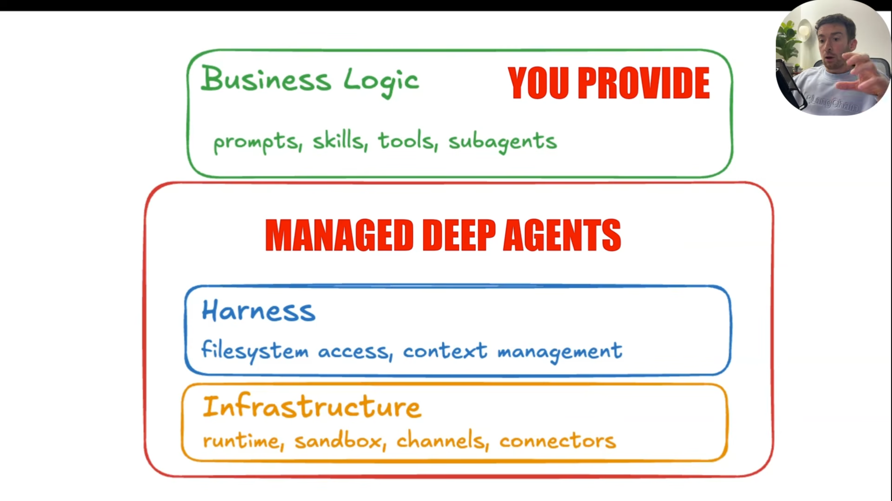
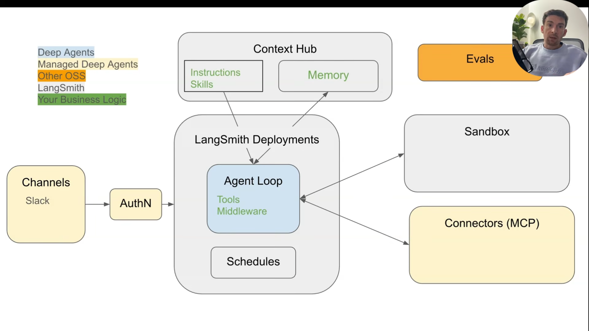

# [YouTube] [LangChain] Managed Deep Agents [ENG, 2026]

<br/>

### Intro

https://www.youtube.com/watch?v=xdrB53bgpp0

<br/>

### Conceptual Video

https://www.youtube.com/watch?v=TUJmfeGTr1Q

<br/>



<br/>



<br/>

### Quickstart

https://www.youtube.com/watch?v=L54dR9qMKzc

<br/>

```bash
$ sudo apt install -y python3-pip
# $ pip install uv
$ pip install uv --break-system-packages
$ export PATH="$HOME/.local/bin:$PATH"

$ cd agents

$ uv venv --python=python3.12
$ source .venv/bin/activate
```

<br/>

https://docs.langchain.com/langsmith/python/managed-deep-agents-quickstart

<br/>

```bash
$ uv tool install managed-deepagents
```

<br/>

```bash

$ mda init research-assistant

│  View raw prompt

$ cd research-assistant
```


<br/>

### Instructions and Context Hub

https://www.youtube.com/watch?v=8HIoZV7qlwA


<br/>

### Skills

https://www.youtube.com/watch?v=Lhru0yMI2as
